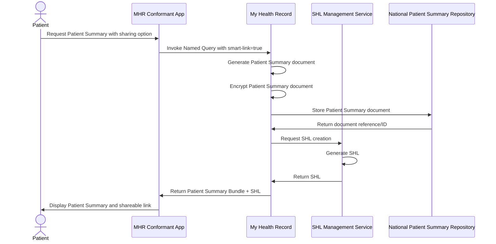
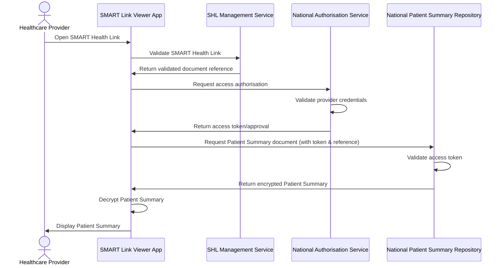
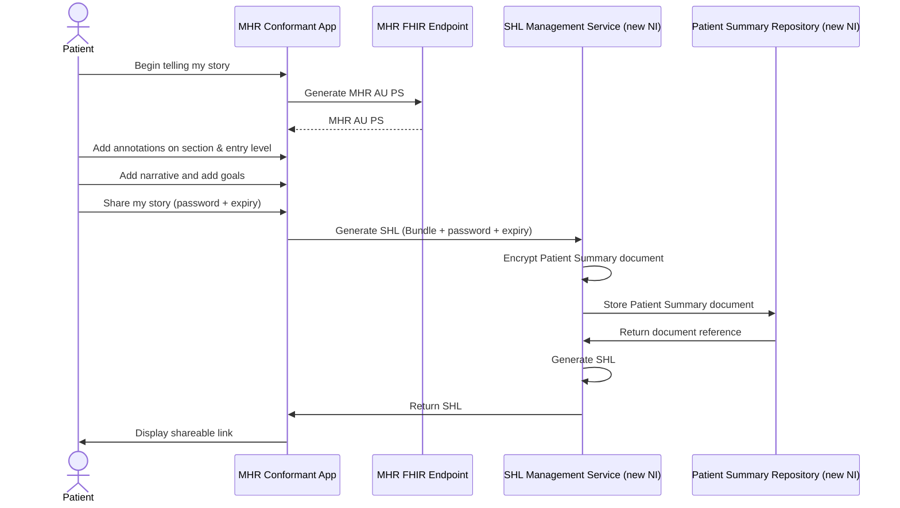
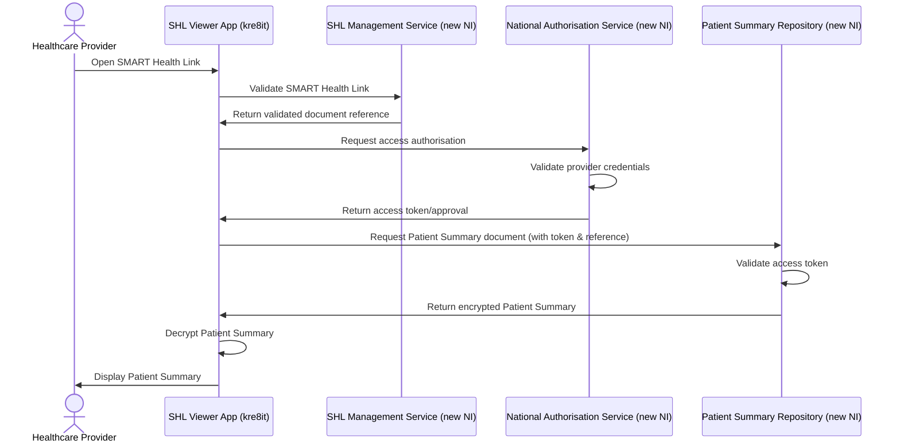

### Overview

The Agency is exploring viable patterns to make health information more accessible to both patients and healthcare providers. This work represents the early stages of technical investigation and exploration.

> **Important**: This is preliminary consultation material. No conclusions should be drawn from this content. There are many steps required to confirm policy, MHR requirements, and security considerations before any technical feasibility can be determined.

### SMART Health Links Exploration

The Agency is actively exploring [SMART Health Links](https://build.fhir.org/ig/HL7/smart-health-cards-and-links/index.html) as one potential option for improving access to patient summaries.

**Current Status:**
- SMART Health Links are in very early exploration stages
- Policy and security approval processes have not yet been initiated
- No assurance has been provided that SMART Health Links meet MHR requirements
- This exploration is for consultation purposes only

### Proposed Pattern

What is presented in this Implementation Guide is an additional parameter to the [Find Content by Patient](OperationDefinition-find-content-by-patient.html) named query. This parameter would:

1. **Store**: The generated Patient Summary document in a national patient summary repository
2. **Generate**: A SMART Health Link for the stored document
3. **Enable Sharing**: Allow patients to share the link with their healthcare providers
4. **Provide Access**: Enable providers to view the Patient Summary through a SMART Health Link Viewer conformant application

## Process Flow

### Sharing Flow

*This flow shows how a patient generates and prepares a Patient Summary for sharing with healthcare providers.*

### Viewing Flow

*This flow shows how a healthcare provider accesses a shared Patient Summary.*

### Security Considerations

> **Critical**: Security requirements are under active investigation and have not been finalised.

Key security areas requiring further exploration include:

- **Access Control**: How access to shared summaries is managed and audited
- **Data Encryption**: Protection of data in transit and at rest (following SMART Health Links standard encryption)
- **Link Security**: SMART Health Link security mechanisms and expiration policies
- **SHL Extensions**: Additional signing and encryption capabilities beyond the standard SMART Health Links specification
- **Authentication**: Provider identity verification requirements
- **Audit Logging**: Comprehensive tracking of access and sharing activities
- **Privacy Controls**: Patient consent and privacy preference management

**Note on SMART Health Links Compliance:**
- File encryption follows the standard SMART Health Links specification using JSON Web Encryption (JWE)
- Additional SHL-level signing and encryption represents extensions to the base specification
- These extensions would require implementation-specific handling while maintaining compatibility with standard SHL viewers

### National Infrastructure Components

The following components have potential to be part of the National Infrastructure:

#### **National Patient Summary Repository**
- Secure storage for generated Patient Summary documents
- Integration with existing MHR infrastructure
- Compliance with national data governance requirements

#### **SHL Management Service**
- Generation and management of SMART Health Links
- Digital signing and encryption of SMART Health Links
- Link validation, signature verification, and decryption
- Link expiration and revocation capabilities
- Security and access control enforcement

#### **National Authorisation Service**
- Provider identity verification and authentication
- Access token generation and validation
- Healthcare provider credential management
- Audit logging of access requests

#### **Provider Access Framework**
- Integration with healthcare provider systems
- SMART Health Link Viewer application standards
- Provider authentication and authorisation services

### Next Steps

Before any implementation can proceed:

1. **Policy Review**: Comprehensive policy analysis and approval processes
2. **Security Assessment**: Full security and privacy impact assessment
3. **MHR Integration**: Detailed analysis of MHR system compatibility
4. **Stakeholder Consultation**: Engagement with healthcare providers and patients
5. **Technical Feasibility**: Detailed technical architecture and implementation planning

### Consultation Questions

The Agency seeks feedback on:

- Is the proposed access pattern useful for healthcare providers?
- What security concerns should be prioritised?
- How should patient control over sharing be implemented?
- What are the key requirements for provider-facing applications?

### Sharing the Patient Summary

*This flow demonstrates the user interaction pattern for generating, contributing to, and sharing a Patient Summary.*

### Accessing the Patient Summary

*This flow shows how a healthcare provider accesses a shared Patient Summary.*

During the September 2025 AU Patient Summary Connectathon, basic interoperability testing was conducted using the kre8it SHL Management Service for SMART Health Link generation and viewing. This testing demonstrated the fundamental technical feasibility of the proposed sharing pattern within a controlled connectathon environment.